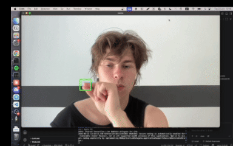

  

 

  <h1>Hi there, I'm Viacheslav 👾</h1>
  
<em>ml/ai engineer · builder · future founder</em>

---

### about me

- livin' right now in Europe
- love building something
- goal: found a unicorn company
- always believing in myself
- positive mental attitude
- open to new connections

---

### what i work with

---

### let's connect

  
  &nbsp;
  

 

  open to collabs — if you're building something interesting, reach out

